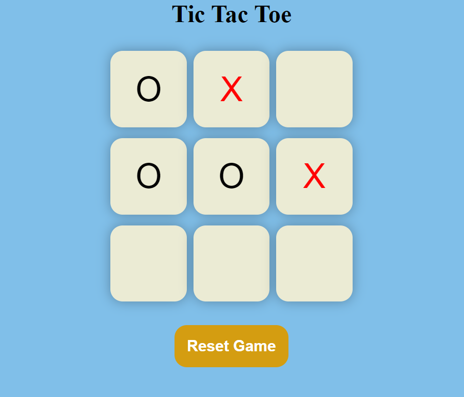
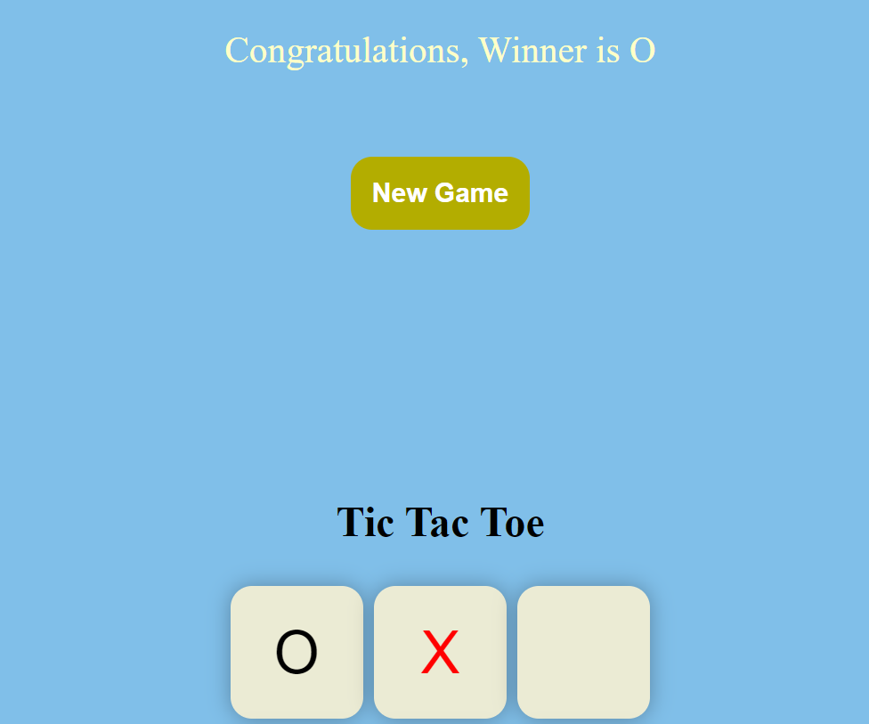

# Tic Tac Toe Game
A classic Tic Tac Toe game built using HTML, CSS, and JavaScript.

## Features
- Two-player game.
- Simple and intuitive UI.
- Real-time game status updates.
- Option to restart the game.

## Screenshots

## How to Play
1. The game is played on a 3x3 grid.
2. Player 1 uses "O" and Player 2 uses "X".
3. Players take turns placing their marks in empty squares.
4. The first player to get three of their marks in a row (horizontally, vertically, or diagonally) wins the game.
5. If all 9 squares are filled and neither player has three in a row, the game is a draw.
